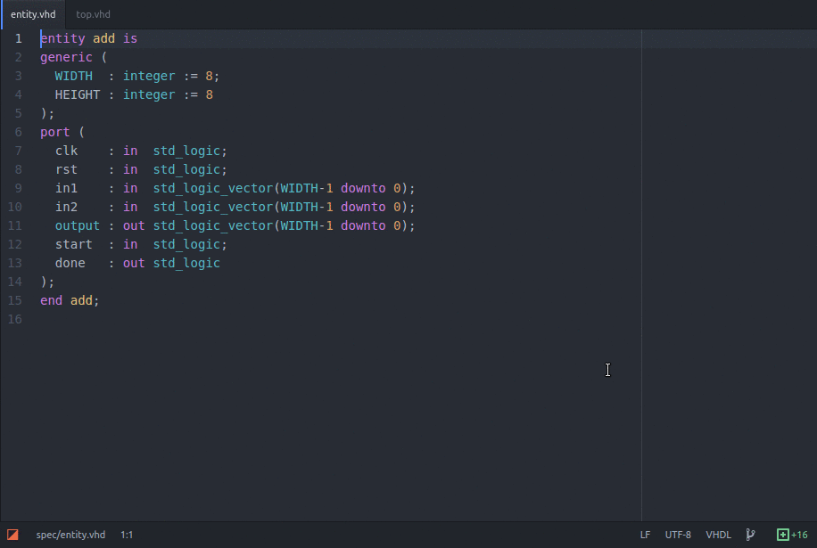

# VHDL Entity Converter

Converts a VHDL entity definition into a component, instance or signal definitions, using the clipboard.

Inspired by [Sublime Text VHDL Utils](https://github.com/korvus81/sublimetext-vhdl-utils). Requires the [VHDL Language](https://atom.io/packages/language-vhdl) package (this will be installed automatically).



## Examples
Starting with the following VHDL entity:
```
entity add is
generic (
  WIDTH  : integer := 8;
  HEIGHT : integer := 8
);
port (
  clk    : in  std_logic;
  rst    : in  std_logic;
  in1    : in  std_logic_vector(WIDTH-1 downto 0);
  in2    : in  std_logic_vector(WIDTH-1 downto 0);
  output : out std_logic_vector(WIDTH-1 downto 0);
  start  : in  std_logic;
  done   : out std_logic
);
end add;
```

### Copy as Component:
`<ctrl>-<shift>-C <ctrl>-<shift>-C` copies the following to the clipboard:
```
component add
generic (
  WIDTH  : integer := 8;
  HEIGHT : integer := 8
);
port (
  clk    : in  std_logic;
  rst    : in  std_logic;
  in1    : in  std_logic_vector(WIDTH-1 downto 0);
  in2    : in  std_logic_vector(WIDTH-1 downto 0);
  output : out std_logic_vector(WIDTH-1 downto 0);
  start  : in  std_logic;
  done   : out std_logic
);
end component add;
```

### Copy as Instance:
`<ctrl>-<shift>-C <ctrl>-<shift>-I` copies the following to the clipboard:
```
add_i : add
generic map (
  WIDTH  => WIDTH,
  HEIGHT => HEIGHT
)
port map (
  clk    => clk,
  rst    => rst,
  in1    => in1,
  in2    => in2,
  output => output,
  start  => start,
  done   => done
);
```

### Copy as Signals
`<ctrl>-<shift>-C <ctrl>-<shift>-S` copies the following to the clipboard:
```
signal clk    : std_logic;
signal rst    : std_logic;
signal in1    : std_logic_vector(WIDTH-1 downto 0);
signal in2    : std_logic_vector(WIDTH-1 downto 0);
signal output : std_logic_vector(WIDTH-1 downto 0);
signal start  : std_logic;
signal done   : std_logic;
```
